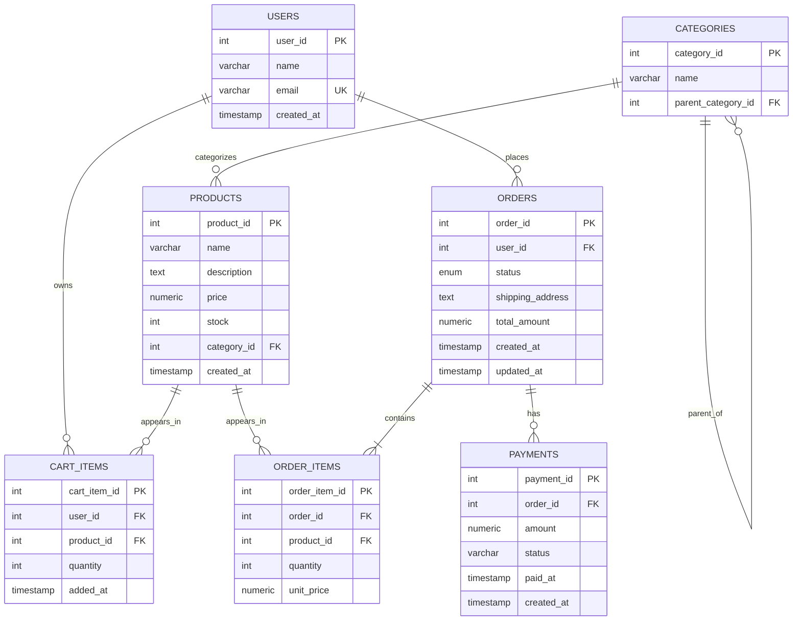

# Cartex

A command-line e-commerce database engine built to demonstrate production-grade SQL - transactions, triggers, stored procedures, and analytics - with no ORM or frontend. Every CLI command prints the SQL it runs before executing it.

---

## Tech stack

Python 3.10 · PostgreSQL 14 · psycopg2

---

## Schema

7 normalised tables (3NF): `users`, `categories`, `products`, `cart_items`, `orders`, `order_items`, `payments`.

Notable design decisions:
- `order_items.unit_price` snapshots the price at purchase time, preserving historical order accuracy across price changes
- `categories.parent_id` is self-referential, supporting unlimited subcategory nesting
- Stock limits, non-negative prices, and quantity constraints enforced as database-level `CHECK` constraints

---

## Key features

**ACID transactions with row-level locking** - checkout runs inside a single transaction using `SELECT ... FOR UPDATE` to lock product rows during stock checks. Prevents overselling when two users buy the last unit simultaneously. Full rollback on any failure.

**Stored procedures** - `place_order`, `cancel_order`, and `get_order_history` are encapsulated at the database layer, enforced regardless of which client connects.

**Triggers** - three automatic triggers: stock restoration on cancellation, price change logging, and a pre-update guard that rejects negative stock at the database level.

**Audit log** - append-only table recording every price change and order status transition, with old and new values stored as JSON.

**Analytics views** - four SQL views queryable from the CLI: revenue by category, top products by units sold, customer lifetime value, and low-stock alerts.

**Full-text search** - product search uses a `FULLTEXT` index on name and description, dropping query time from ~420ms (sequential scan) to ~3ms on 10,000 rows.

**Raw SQL passthrough** - the `sql` command runs any query directly against the live database and prints results as a formatted table with execution time.

---

## Setup

```bash
git clone https://github.com/Rayyan973/cartex.git
cd cartex && pip install -r requirements.txt

psql -U postgres -c "CREATE DATABASE cartex;"
psql -U postgres -d cartex -f schema/01_tables.sql
psql -U postgres -d cartex -f schema/02_indexes.sql
psql -U postgres -d cartex -f schema/03_views.sql
psql -U postgres -d cartex -f schema/04_procedures.sql
psql -U postgres -d cartex -f schema/05_triggers.sql
psql -U postgres -d cartex -f seed/seed_data.sql

python cli/main.py
```


## ER Diagram
